## 1. Расширение функциональности репозиториев

Стандартного набора методов `JpaRepository` (например, `findById`, `save`, `delete`) часто
недостаточно для бизнес-логики. Существует три основных способа добавления собственных методов (query methods) в репозиторий.

### Что такое репозиторий и зачем его расширять?

**Репозиторий (Repository)** — это паттерн проектирования, который абстрагирует доступ к данным. В
Spring Data JPA репозиторий — это интерфейс, через который приложение взаимодействует с базой
данных, не заботясь о деталях реализации (SQL-запросах, соединениях, транзакциях).

Стандартный интерфейс `JpaRepository<Entity, ID>` предоставляет базовый набор методов:

- `findById(ID)` — найти по идентификатору;
- `save(Entity)` — сохранить или обновить;
- `deleteById(ID)` — удалить;
- `findAll()` — получить все записи.

**Проблема**: бизнес-логика часто требует более сложных запросов — поиск по нескольким условиям,
агрегации, проекции в DTO, работа с сырым SQL.

**Решение**: Spring Data JPA предлагает три способа добавления собственных методов:

1. Naming Convention — быстро, просто.
2. @Query — гибко, явно.
3. Custom Interface — максимальная гибкость.

---

### 1.1. Автоматическая генерация через Naming Convention

#### Что это такое?

**Naming Convention (соглашение об именовании)** — это набор правил, по которым Spring Data JPA
анализирует имя метода и автоматически генерирует SQL-запрос. Ты просто описываешь, *что* хочешь
получить, а Spring решает, *как* это сделать.

#### Как это работает пошагово

1. **Объявление метода.** Ты добавляешь метод в интерфейс репозитория.
2. **Парсинг имени.** Spring разбирает имя метода на составные части:
    - префикс действия: `findBy`, `readBy`, `queryBy`, `countBy`, `deleteBy`, `existsBy`;
    - поля сущности: `Title`, `UserEmail`, `CreatedAt`;
    - операторы условий: `Like`, `Contains`, `Between`, `GreaterThan`, `IsNull`, `In`, `OrderBy`.
3. **Генерация запроса.** На основе разбора строится JPQL-запрос.
4. **Выполнение.** При вызове метода выполняется сгенерированный запрос.

#### Пример кода с подробным разбором

```java

@Repository
public interface CourseRepository extends JpaRepository<Course, Long> {

    // Разбор имени метода:
    // findBy          → действие: SELECT с условием WHERE
    // Title           → поле сущности Course: c.title
    // Like            → оператор: LIKE с подстановкой %
    // Параметр String title → подставляется вместо :title

    List<Course> findByTitleLike(String title);

    // Более сложный пример:
    // Найти курсы, где заголовок содержит текст И цену в диапазоне, 
    // отсортированные по дате создания
    List<Course> findByTitleContainingAndPriceBetweenOrderByCreatedAtDesc(
        String title, BigDecimal minPrice, BigDecimal maxPrice);
}
```

#### Поддерживаемые ключевые слова (фрагмент)

| Ключевое слово | JPQL-фрагмент | Пример метода |
|---------------|---------------|---------------|
| `Like` | `LIKE ?1` | `findByTitleLike(String title)` |
| `Containing` | `LIKE %?1%` | `findByTitleContaining(String text)` |
| `Between` | `BETWEEN ?1 AND ?2` | `findByPriceBetween(BigDecimal a, BigDecimal b)` |
| `GreaterThan` | `> ?1` | `findByRatingGreaterThan(Double rating)` |
| `IsNull` / `IsNotNull` | `IS NULL` / `IS NOT NULL` | `findByDeletedAtIsNull()` |
| `In` / `NotIn` | `IN ?1` / `NOT IN ?1` | `findByStatusIn(List<Status> statuses)` |
| `OrderBy` | `ORDER BY` | `findByActiveTrueOrderByCreatedAtDesc()` |

#### Плюсы и минусы

**Преимущества**

- **Быстро.** Не нужно писать запросы вручную.
- **Типобезопасно.** Ошибки в именах полей ловятся на этапе компиляции.
- **Читаемо.** Имя метода само документирует логику.
- **Рефакторинг дружелюбно.** При переименовании поля IDE предложит исправить метод.

**Ограничения**

- **Сложность.** Запросы с JOIN, GROUP BY, подзапросами невозможно выразить.
- **Длинные имена.** Методы вида `findByUserEmailAndCourseStatusAndEnrollmentDateAfter...` трудно
  читать.
- **Производительность.** Сложно контролировать план выполнения запроса.

**Документация**: полный список ключевых
слов: [Spring Data JPA Query Methods](https://docs.spring.io/spring-data/jpa/reference/jpa/query-methods.html).

---

### 1.2. Аннотация @Query (ручное написание запросов)

#### Зачем нужна @Query?

Когда возможностей Naming Convention недостаточно, используется аннотация `@Query`. Она позволяет **явно указать запрос**, давая полный контроль над логикой выборки данных.

#### Два типа запросов

##### 1. JPQL (Java Persistence Query Language)

**Определение**: JPQL — это объектно-ориентированный язык запросов, часть спецификации JPA. Он
работает с **сущностями и их полями**, а не с таблицами и колонками БД.

**Ключевые особенности**

- Независимость от СУБД: один и тот же запрос работает с PostgreSQL, MySQL, Oracle.
- Типобезопасность: компилятор проверяет имена полей сущностей.
- Работа с наследованием сущностей.

**Пример**

```java

@Query("SELECT c FROM Course c WHERE c.title LIKE %:title%")
List<Course> findByTitleLike(@Param("title") String title);
```

**Разбор синтаксиса**

- `SELECT c` — выбираем объекты сущности `Course`, а не строки таблицы.
- `FROM Course c` — `Course` это имя Java-класса, `c` — псевдоним.
- `WHERE c.title` — обращаемся к полю Java-объекта, а не колонке `course.title`.
- `:title` — именованный параметр (рекомендуется использовать `@Param` для ясности).

##### 2. Native SQL (Чистый SQL)

**Определение**: Native Query — это запрос на языке конкретной СУБД. Используется, когда нужны
специфические функции БД, оптимизации или работа с legacy-схемой.

**Пример**

```java

@Query(
    value = """
        SELECT c.*, u.email as user_email 
        FROM course c
        INNER JOIN users u ON c.user_id = u.id
        WHERE c.title LIKE CONCAT('%', :title, '%')
        ORDER BY c.created_at DESC
        LIMIT :limit
        """,
    nativeQuery = true
)
List<Course> findCoursesByTitleWithUserEmail(
    @Param("title") String title,
    @Param("limit") int limit
);
```

**Важные нюансы nativeQuery**

- `value` — строка SQL-запроса.
- `nativeQuery = true` — флаг, сообщающий Spring, что это SQL, а не JPQL.
- Возвращаемый тип должен соответствовать структуре результата (сущность, DTO, Tuple).
- Имена параметров в SQL должны совпадать с `@Param` или использовать позиционные `?1`, `?2`.

#### Сравнение JPQL и Native SQL

| Критерий | JPQL | Native SQL |
|----------|------|-----------|
| **Объект запроса** | Сущности (классы) | Таблицы и колонки |
| **Портативность** | Высокая (любая СУБД) | Низкая (привязка к СУБД) |
| **Гибкость** | Ограничена возможностями JPA | Полная (все функции СУБД) |
| **Рефакторинг** | IDE помогает переименовывать | Риск поломки при изменении схемы |
| **Производительность** | Зависит от трансляции Hibernate | Прямое выполнение, можно оптимизировать |

#### HQL vs JPQL — в чем разница?

- **HQL (Hibernate Query Language)** — язык запросов Hibernate, предшественник JPQL.
- **JPQL** — стандартизированная версия, часть JPA-спецификации.
- **На практике**: синтаксис почти идентичен, но HQL имеет дополнительные возможности Hibernate (например, bulk operations, специфичные функции). В Spring Data JPA по умолчанию используется JPQL.

---

### 1.3. Расширение репозитория кастомным интерфейсом

#### Когда это нужно?

Этот способ используется:

- когда нужна **сложная бизнес-логика**, которую нельзя выразить через JPQL;
- требуется **динамическое построение запросов** (условия формируются в runtime);
- нужен **прямой доступ к EntityManager** для тонкого управления;
- выполняются **массовые операции** (batch insert/update) для производительности;
- используются **специфичные функции БД**, недоступные в JPQL.

#### Алгоритм подключения (3 шага)

##### Шаг 1. Создание интерфейса с сигнатурами методов

```java
/**
 * Интерфейс для кастомных методов CourseRepository.
 * Не наследует JpaRepository — только декларация методов.
 */
public interface CustomCourseRepository {

    /**
     * Найти базовую информацию о курсах пользователя.
     * Возвращает DTO вместо сущности для оптимизации (не грузим лишние поля).
     *
     * @param userId ID пользователя
     * @return список DTO с заголовками курсов
     */
    List<CourseDto> findCoursesBasicInfo(Long userId);

    /**
     * DTO для передачи данных — лёгкий объект без связей с БД.
     * record (Java 14+) — иммутабельный класс с автогенерацией методов.
     */
    record CourseDto(String title, Long id, String instructorName) {
    }
}
```

##### Шаг 2. Реализация интерфейса

**Критически важное правило**: класс реализации **обязательно** должен иметь суффикс `Impl`
относительно имени интерфейса. Spring автоматически находит класс по этому соглашению.

```java

@Repository
@Transactional(readOnly = true) // Оптимизация: транзакция только для чтения
public class CustomCourseRepositoryImpl implements CustomCourseRepository {

    /**
     * @PersistenceContext — внедрение EntityManager от Spring.
     * Важно: не создавай EntityManager вручную через Persistence.createEntityManagerFactory!
     */
    @PersistenceContext
    private EntityManager em;

    @Override
    public List<CourseDto> findCoursesBasicInfo(Long userId) {
        /**
         * Создаём JPQL-запрос вручную через EntityManager.
         * Преимущества перед @Query:
         * - Динамическое построение (можно добавлять условия в цикле)
         * - Доступ к Criteria API для типобезопасных запросов
         * - Прямой контроль над fetch size, hints, lock mode
         */
        final List<Tuple> tuples = em.createQuery(
                """
                    SELECT c.title AS title, c.id AS id, u.fullName AS instructorName 
                    FROM Course c 
                    JOIN c.instructor u 
                    WHERE c.user.id = :userId AND c.deleted = false
                    """,
                Tuple.class // Tuple — структура для проекции (не полноценная сущность)
            )
            .setParameter("userId", userId)
            .setHint("org.hibernate.readOnly", true) // Подсказка: не отслеживать изменения
            .getResultList();

        /**
         * Маппинг результатов в DTO.
         * Tuple.get("alias", Type) — безопасное получение полей по алиасам из SELECT.
         */
        return tuples.stream()
            .map(tuple -> new CourseDto(
                tuple.get("title", String.class),
                tuple.get("id", Long.class),
                tuple.get("instructorName", String.class)
            ))
            .toList();
    }
}
```

**Пояснение ключевых моментов**

- `@Transactional(readOnly = true)` — подсказка Hibernate не создавать снапшоты для dirty checking,
  что ускоряет чтение.
- `Tuple` — используется, когда запрос возвращает не полноценные сущности, а проекцию (несколько
  полей).
- `.setHint(...)` — передача vendor-specific-подсказок Hibernate (аналог QueryHints в @Query).

##### Шаг 3. Подключение к основному репозиторию

```java
/**
 * Основной репозиторий наследует:
 * 1. JpaRepository — стандартные CRUD-методы
 * 2. CustomCourseRepository — ваши кастомные методы
 *
 * Spring автоматически «склеит» реализации.
 */
@Repository
public interface CourseRepository extends JpaRepository<Course, Long>, CustomCourseRepository {
    // Здесь доступны ВСЕ методы:
    // - findById, save, delete (из JpaRepository)
    // - findCoursesBasicInfo (из CustomCourseRepository)
    // - findByTitleLike (если добавите через Naming Convention)
}
```

#### Важные правила и нюансы

**Обязательные условия**

- Суффикс `Impl` в названии класса реализации (`CustomCourseRepositoryImpl`).
- Класс должен быть аннотирован `@Repository` или быть Spring-бином.
- Интерфейс не должен наследовать `JpaRepository` (только декларация методов).

**Возможности в реализации**

- Внедрение любых Spring-бинов: `JdbcTemplate`, `DataSource`, другие сервисы.
- Использование `EntityManager` для Criteria API, native queries, управления транзакциями.
- Применение `@QueryHint`, `setFetchSize`, `setLockMode` для тонкой настройки.

**Прозрачность для клиента**:
для контроллера или сервиса это выглядит как один репозиторий:

```java

@Service
public class CourseService {
    private final CourseRepository courseRepo; // Один интерфейс — все методы доступны

    public void showUserCourses(Long userId) {
        // Стандартный метод
        var course = courseRepo.findById(1L).orElseThrow();
        // Кастомный метод
        var dtos = courseRepo.findCoursesBasicInfo(userId);
    }
}
```

---

## 2. Производительность (Performance)

### Почему производительность критична в JPA?

ORM-фреймворки (Object-Relational Mapping), такие как Hibernate, абстрагируют работу с БД, но эта
абстракция имеет цену. Непонимание механики работы может привести:

- **к тысячам лишних SQL-запросов** (проблема N+1);
- **перегрузке памяти** (загрузка миллионов сущностей в JVM);
- **блокировкам и deadlock'ам** при неправильном управлении транзакциями;
- **медленным ответам API** из-за неоптимальных запросов.

**Золотое правило**: всегда мониторь SQL-запросы в development/staging. То, что работает на 10
записях, может «упасть» на 10 000.

---

### 2.1. Кеширование в Hibernate

#### Архитектура: Factory и Session

1.  **Hibernate Core (реализация)**
*   `SessionFactory`: тяжеловесный, потокобезопасный объект. Создается **один на приложение**. Хранит метаданные (маппинг сущностей), настройки БД и **кеш второго уровня (L2)**.
*   `Session`: легковесный, **не потокобезопасный** объект. Создаётся на каждое взаимодействие (обычно на запрос/транзакцию). Хранит **кеш первого уровня (L1)**. Это «рабочая область» для сущностей.

2.  **JPA (спецификация)**
*   `EntityManagerFactory` (EMF): аналог `SessionFactory`.
*   `EntityManager` (EM): аналог `Session`. В коде Spring Data JPA ты работаешь именно с ним.
*   *Важно*: под капотом стандартный `EntityManager` в Spring делегирует вызовы Hibernate `Session`.

3.  **Spring Data JPA (оркестратор)**
*   Spring не создаёт новый `EntityManager` для каждого метода репозитория «в лоб».
*   Spring управляет жизненным циклом EM через `TransactionManager`.
*   В пределах одной транзакции Spring **переиспользует один и тот же экземпляр EntityManager** (и, следовательно, одну Сессию Hibernate и один Контекст Постоянства L1).

---

#### Hibernate L1 Cache (кеш первого уровня)

##### Определение и характеристики
*   **Уровень**: `EntityManager` (в рамках одной транзакции).
*   **Статус**: включён **всегда**, отключить нельзя.
*   **Принцип работы (Identity Map)**: гарантирует, что в рамках одной транзакции сущность с одним ID существует в единственном экземпляре в памяти.
*   **Dirty Checking**: Hibernate отслеживает изменения полей сущности в памяти. При коммите транзакции он автоматически генерирует `UPDATE`, если данные изменились.

##### Механика работы (по шагам)

**1. Чтение (`findById`/`getReference`)**

```java

@Transactional
public void example() {
    // Первый вызов: L1 пуст → SQL SELECT → объект в L1
    User user1 = userRepository.findById(1L).get();

    // Второй вызов: объект в L1 → возврат ссылки из памяти, SQL НЕ выполняется
    User user2 = userRepository.findById(1L).get();

    // user1 == user2 → true (один и тот же объект в памяти!)
}
```

**2. Dirty Checking (отслеживание изменений).**
Hibernate автоматически отслеживает изменения полей управляемых (`MANAGED`) сущностей.

```java

@Transactional
public void updateUser(Long id) {
    User user = userRepository.findById(id).get(); // MANAGED, в L1
    user.setEmail("new@example.com"); // Изменение в памяти

    // При commit():
    // 1. Hibernate сравнивает текущее состояние с снапшотом (сделанным при загрузке).
    // 2. Если есть изменения, генерирует UPDATE.
    // 3. Выполняет SQL: UPDATE users SET email='new@example.com' WHERE id=?.
}
```

**3. Flush (синхронизация с БД)**

- **Автоматический flush**: происходит перед `commit()` и перед выполнением JPQL-запросов (чтобы
  запрос видел актуальные данные).
- **Ручной flush**: `entityManager.flush()` — принудительная синхронизация.

```java

@Transactional
public void forceFlush() {
    User user = userRepository.findById(1L).get();
    user.setName("New Name");

    // Принудительная синхронизация ДО конца транзакции
    entityManager.flush();
    // SQL UPDATE выполнен здесь, а не при commit

    // Дальнейшие операции видят изменения в БД (например, триггеры, другие транзакции)
}
```

##### Визуализация работы L1 (Sequence Diagram)

###### 1. Чтение (findById) с промахом и попаданием в кеш

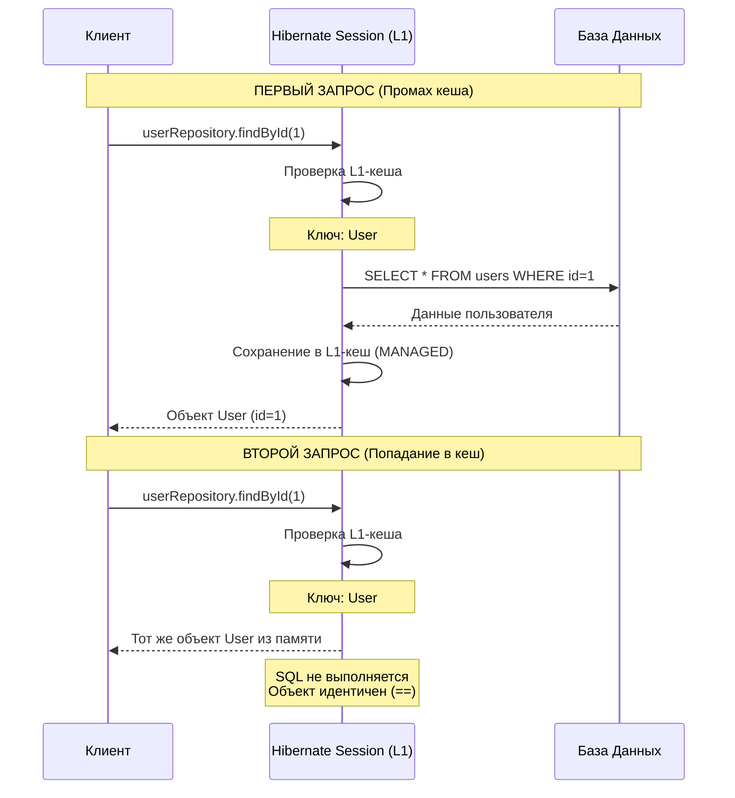
```mermaid
sequenceDiagram
    participant Client as Клиент
    participant Session as Hibernate Session (L1)
    participant DB as База Данных

    Note over Client,DB: ПЕРВЫЙ ЗАПРОС (Промах кеша)
    
    Client->>Session: userRepository.findById(1)
    Session->>Session: Проверка L1-кеша
    Note over Session: Ключ: User#1<br/>Результат: не найден
    Session->>DB: SELECT * FROM users WHERE id=1
    DB-->>Session: Данные пользователя
    Session->>Session: Сохранение в L1-кеш (MANAGED)
    Session-->>Client: Объект User (id=1)
    
    Note over Client,DB: ВТОРОЙ ЗАПРОС (Попадание в кеш)
    
    Client->>Session: userRepository.findById(1)
    Session->>Session: Проверка L1-кеша
    Note over Session: Ключ: User#1<br/>Результат: найден
    Session-->>Client: Тот же объект User из памяти
    Note over Session: SQL не выполняется<br/>Объект идентичен (==)
```

###### 2. Изменение объекта и Dirty Checking

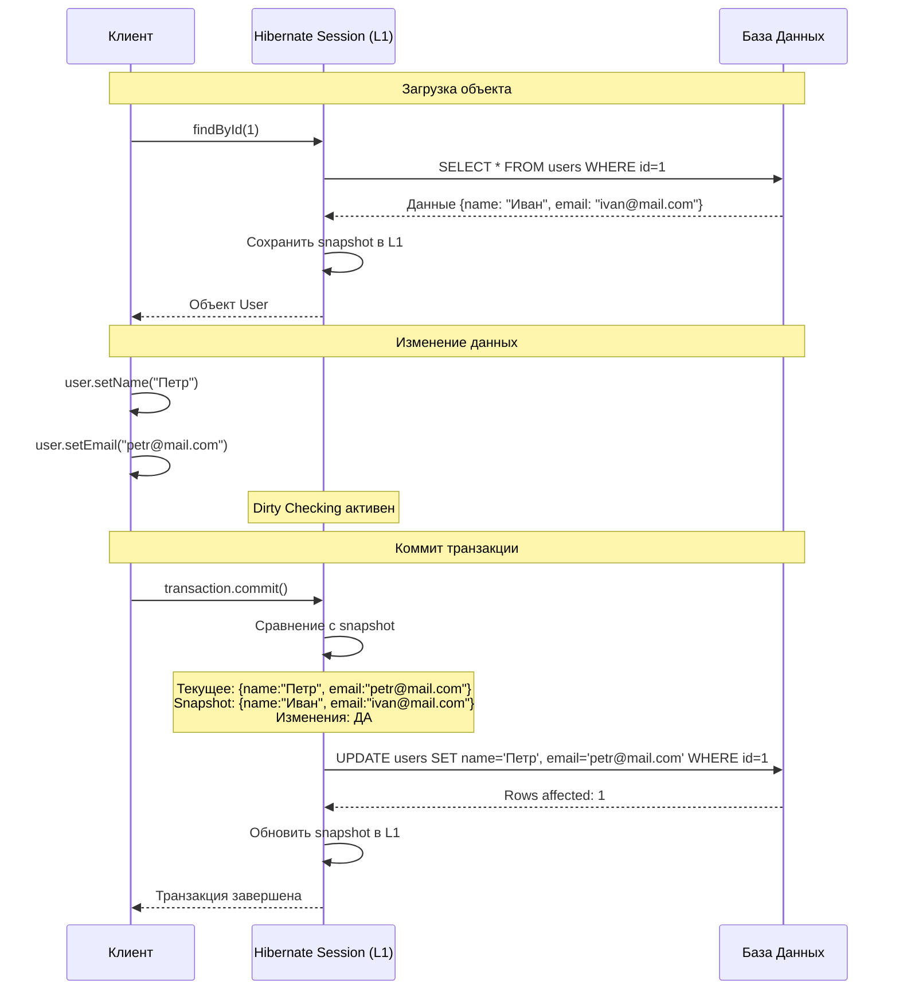
```mermaid
sequenceDiagram
    participant Client as Клиент
    participant Session as Hibernate Session (L1)
    participant DB as База Данных

    Note over Client,DB: Загрузка объекта
    
    Client->>Session: findById(1)
    Session->>DB: SELECT * FROM users WHERE id=1
    DB-->>Session: Данные {name: "Иван", email: "ivan@mail.com"}
    Session->>Session: Сохранить snapshot в L1
    Session-->>Client: Объект User
    
    Note over Client,DB: Изменение данных
    
    Client->>Client: user.setName("Петр")
    Client->>Client: user.setEmail("petr@mail.com")
    Note over Session: Dirty Checking активен
    
    Note over Client,DB: Коммит транзакции
    
    Client->>Session: transaction.commit()
    Session->>Session: Сравнение с snapshot
    Note over Session: Текущее: {name:"Петр", email:"petr@mail.com"}<br/>Snapshot: {name:"Иван", email:"ivan@mail.com"}<br/>Изменения: ДА
    Session->>DB: UPDATE users SET name='Петр', email='petr@mail.com' WHERE id=1
    DB-->>Session: Rows affected: 1
    Session->>Session: Обновить snapshot в L1
    Session-->>Client: Транзакция завершена
```

###### 3. Принудительный flush() и автоматический flush перед запросом

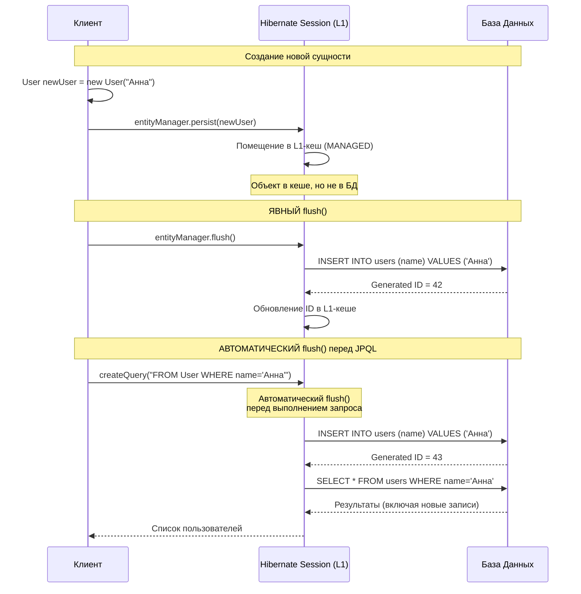
```mermaid
sequenceDiagram
    participant Client as Клиент
    participant Session as Hibernate Session (L1)
    participant DB as База Данных

    Note over Client,DB: Создание новой сущности
    
    Client->>Client: User newUser = new User("Анна")
    Client->>Session: entityManager.persist(newUser)
    Session->>Session: Помещение в L1-кеш (MANAGED)
    Note over Session: Объект в кеше, но не в БД
    
    Note over Client,DB: ЯВНЫЙ flush()
    
    Client->>Session: entityManager.flush()
    Session->>DB: INSERT INTO users (name) VALUES ('Анна')
    DB-->>Session: Generated ID = 42
    Session->>Session: Обновление ID в L1-кеше
    
    Note over Client,DB: АВТОМАТИЧЕСКИЙ flush() перед JPQL
    
    Client->>Session: createQuery("FROM User WHERE name='Анна'")
    Note over Session: Автоматический flush()<br/>перед выполнением запроса
    Session->>DB: INSERT INTO users (name) VALUES ('Анна')
    DB-->>Session: Generated ID = 43
    Session->>DB: SELECT * FROM users WHERE name='Анна'
    DB-->>Session: Результаты (включая новые записи)
    Session-->>Client: Список пользователей
```

###### 4. Закрытие сессии и переход в состояние DETACHED

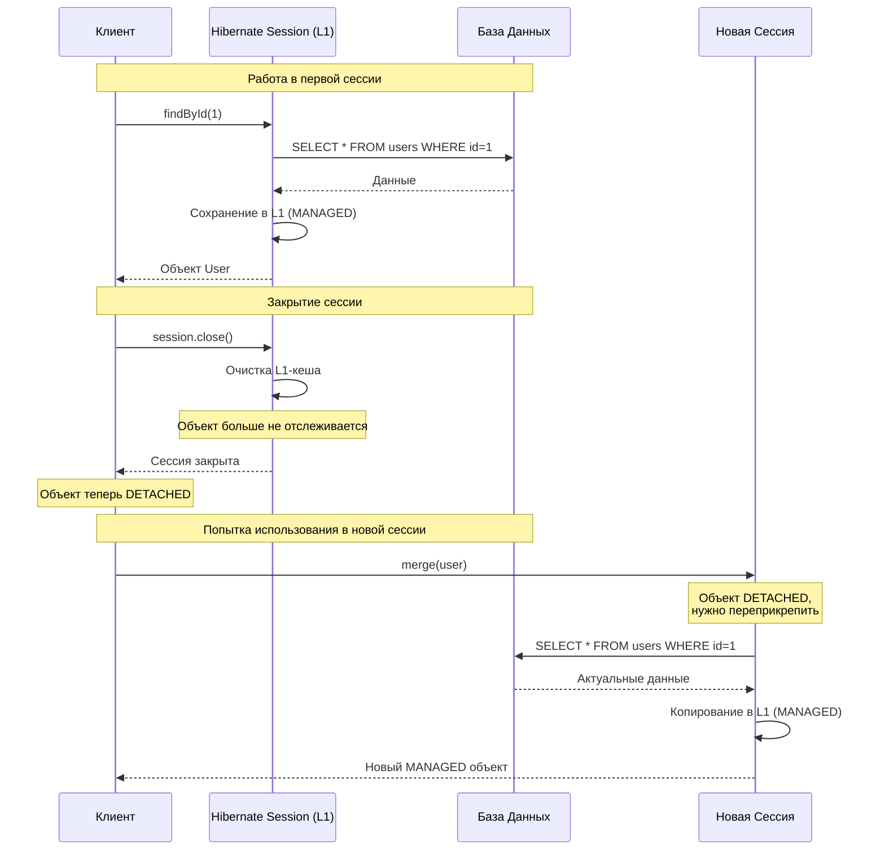
```mermaid
sequenceDiagram
    participant Client as Клиент
    participant Session as Hibernate Session (L1)
    participant DB as База Данных
    participant NewSession as Новая Сессия

    Note over Client,DB: Работа в первой сессии
    
    Client->>Session: findById(1)
    Session->>DB: SELECT * FROM users WHERE id=1
    DB-->>Session: Данные
    Session->>Session: Сохранение в L1 (MANAGED)
    Session-->>Client: Объект User
    
    Note over Client,DB: Закрытие сессии
    
    Client->>Session: session.close()
    Session->>Session: Очистка L1-кеша
    Note over Session: Объект больше не отслеживается
    Session-->>Client: Сессия закрыта
    Note over Client: Объект теперь DETACHED
    
    Note over Client,DB: Попытка использования в новой сессии
    
    Client->>NewSession: merge(user)
    Note over NewSession: Объект DETACHED,<br/>нужно переприкрепить
    NewSession->>DB: SELECT * FROM users WHERE id=1
    DB-->>NewSession: Актуальные данные
    NewSession->>NewSession: Копирование в L1 (MANAGED)
    NewSession-->>Client: Новый MANAGED объект
```

##### Практические нюансы L1

**Проблема**: L1 живёт только в рамках транзакции. После `commit()` и закрытия `EntityManager`
кеш очищается, объекты переходят в состояние `DETACHED`.

```java
// Транзакция 1
@Transactional
public User loadUser() {
    return userRepository.findById(1L).get(); // Объект MANAGED, в L1
} // Транзакция завершена → L1 очищен → объект стал DETACHED

// Транзакция 2
@Transactional
public void updateUser(User detachedUser) {
    // detachedUser больше не отслеживается Hibernate
    // Чтобы сохранить изменения, нужно:
    // 1) загрузить заново: userRepository.findById(1L)
    // 2) или использовать merge(): userRepository.merge(detachedUser)
}
```

---

#### Hibernate L2 Cache (кеш второго уровня)

##### Определение и характеристики

*   **Уровень**: `EntityManagerFactory` (глобальный для всего приложения).
*   **Статус**: выключен по умолчанию. Требует настройки.
*   **Принцип работы**: данные кешируются между разными транзакциями и потоками. Подходит для справочников (данные, которые часто читают, но редко меняют).
*   **Хранение**: данные хранятся в десериализованном виде (не как Java-объекты), чтобы экономить память и избегать проблем сериализации.
*   **Провайдеры**: Hibernate сам не хранит данные, он делегирует это внешним системам: **Ehcache, Redis, Hazelcast, Infinispan**.

##### Провайдеры кеша (кто хранит данные?)

Hibernate не хранит данные в L2 сам — он делегирует это внешним системам через стандарт JCache (JSR-107).

| Провайдер | Особенности | Когда использовать |
|-----------|-------------|-------------------|
| **Ehcache** | In-memory, disk persistence, кластеризация | Универсальный выбор, хорошая документация |
| **Redis** | Распределенный, persistence, pub/sub | Микросервисы, распределённые приложения |
| **Hazelcast** | In-memory data grid, кластеризация | Высоконагруженные системы, распределённые кеши |
| **Infinispan** | Распределённый, транзакционный, с поддержкой JTA | Enterprise-приложения с требованиями к консистентности |

##### Подключение L2 (пошагово)

**Шаг 1: добавить зависимости (build.gradle)**

```gradle
dependencies {
    // Интеграция Hibernate с JCache (стандарт кеширования)
    implementation 'org.hibernate:hibernate-jcache'
    
    // Реализация JCache (выберите один провайдер)
    implementation 'org.ehcache:ehcache'
    // или
    implementation 'org.redisson:redisson-spring-boot-starter'
}
```

**Шаг 2: настроить в application.yml**

```yaml
spring:
  jpa:
    properties:
      hibernate:
        cache:
          use_second_level_cache: true          # Включаем L2-кеш
          use_query_cache: true                 # Опционально: кеш результатов запросов
          region:
            factory_class: org.hibernate.cache.jcache.JCacheRegionFactory # Адаптер к JCache
          # Настройки Ehcache (если используется)
          ehcache:
            configXml: classpath:ehcache.xml    # Путь к конфигурации провайдера
```

**Шаг 3: настроить провайдер (пример ehcache.xml)**

```xml

<config xmlns:xsi='http://www.w3.org/2001/XMLSchema-instance'
        xmlns='http://www.ehcache.org/v3'
        xsi:schemaLocation='http://www.ehcache.org/v3 http://www.ehcache.org/schema/ehcache-core.xsd'>

    <!-- Регион для сущностей Country -->
    <cache alias="countryCache">
        <expiry>
            <ttl unit="hours">24</ttl> <!-- Время жизни записи -->
        </expiry>
        <resources>
            <heap unit="entries">1000</heap> <!-- В памяти -->
            <offheap unit="MB">10</offheap>  <!-- Вне кучи (direct memory) -->
        </resources>
    </cache>

    <!-- Регион для кеша запросов -->
    <cache alias="org.hibernate.cache.internal.StandardQueryCache">
        <expiry>
            <ttl unit="minutes">30</ttl>
        </expiry>
        <resources>
            <heap unit="entries">500</heap>
        </resources>
    </cache>
</config>
```

**Шаг 4: аннотировать сущность**

```java

@Entity
@Table(name = "countries")
@Cacheable // 1. Стандартная JPA-аннотация: разрешить кеширование в L2
@org.hibernate.annotations.Cache(
    usage = CacheConcurrencyStrategy.READ_ONLY, // 2. Стратегия доступа
    region = "countryCache"                      // 3. Имя региона (должен быть в ehcache.xml)
)
public class Country {
    @Id
    @GeneratedValue
    private Long id;
    private String code;
    private String name;
    // getters, setters
}
```

##### Разбор аннотаций

**`@jakarta.persistence.Cacheable`**

- Стандартная аннотация JPA (не Hibernate-specific).
- Просто маркирует сущность как «кандидата на кеширование».
- Не задаёт стратегию или регион — только включает/выключает.
- Не влияет на L1-кеш (он всегда включён).

**`@org.hibernate.annotations.Cache`**

- Hibernate-specific аннотация для детальной настройки.
- **`usage`** (обязательный): определяет стратегию конкурентного доступа.
- **`region`** (опциональный): имя логической группы кеша для настройки TTL, размера и так далее.

##### Стратегии конкурентного доступа (Concurrency Strategies)

| Стратегия | Описание | Блокировки | Когда использовать | Производительность |
|-----------|----------|-----------|-------------------|--------------------|
| **READ_ONLY** | Данные только для чтения, никогда не меняются | Нет | Справочники, страны, валюты, конфигурации | Максимальная       |
| **READ_WRITE** | Чтение и запись с мягкими блокировками | Оптимистичные (soft locks) | Данные, которые читаются часто, пишутся редко | Средняя            |
| **NONSTRICT_READ_WRITE** | Чтение и запись без строгой согласованности | Нет | Когда допустима устаревшая информация на короткое время | Средняя            |
| **TRANSACTIONAL** | Полная транзакционная поддержка (требует JTA) | Пессимистичные | Критичные данные с требованиями к консистентности | Ниже среднего      |

##### Как работает L2 на практике (Sequence Diagram)

```
Первое обращение (промах L2):

Клиент → Session1: findById(1)
Session1 → L2: Проверка (ключ: Country#RU)
L2 → Session1: Не найдено (промах)
Session1 → DB: SELECT * FROM countries WHERE code='RU'
DB → Session1: Данные
Session1 → Session1: Сохранение в L1 (текущая транзакция)
Session1 → L2: Сохранение в L2 (для будущих сессий)
Session1 → Клиент: Объект Country

Второе обращение из ДРУГОЙ транзакции (попадание L2):

Клиент → Session2: findById(1)
Session2 → L2: Проверка (ключ: Country#RU)
L2 → Session2: Данные из L2! (без SQL)
Session2 → Session2: Сохранение в L1
Session2 → Клиент: Объект Country (из кеша)
```

##### Подробные примеры работы L2

##### 1. Чтение с L2-кешем (первое обращение — промах)

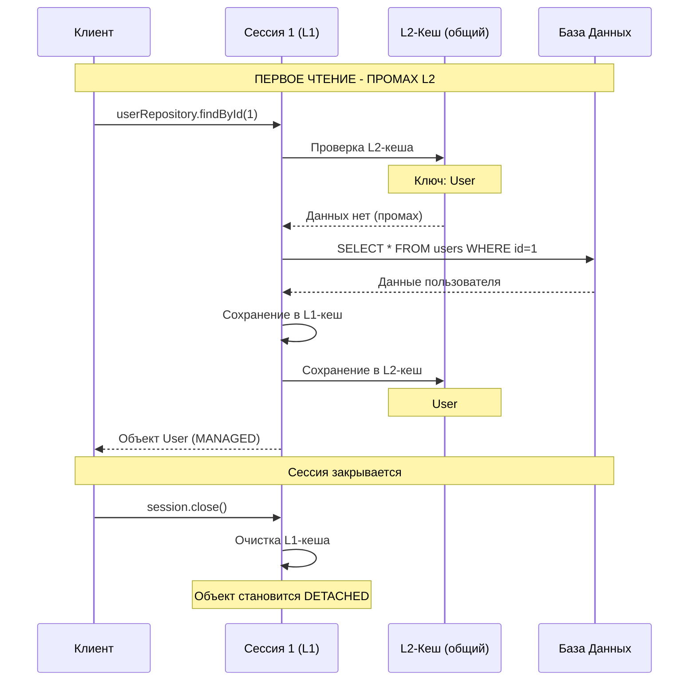
```mermaid
sequenceDiagram
    participant Client as Клиент
    participant S1 as Сессия 1 (L1)
    participant L2 as L2-Кеш (общий)
    participant DB as База Данных

    Note over Client,DB: ПЕРВОЕ ЧТЕНИЕ - ПРОМАХ L2
    
    Client->>S1: userRepository.findById(1)
    S1->>L2: Проверка L2-кеша
    Note over L2: Ключ: User#1
    L2-->>S1: Данных нет (промах)
    
    S1->>DB: SELECT * FROM users WHERE id=1
    DB-->>S1: Данные пользователя
    
    S1->>S1: Сохранение в L1-кеш
    S1->>L2: Сохранение в L2-кеш
    Note over L2: User#1 сохранён
    
    S1-->>Client: Объект User (MANAGED)
    
    Note over Client,DB: Сессия закрывается
    Client->>S1: session.close()
    S1->>S1: Очистка L1-кеша
    Note over S1: Объект становится DETACHED
```

##### 2. Чтение с L2-кешем (второе обращение — попадание)

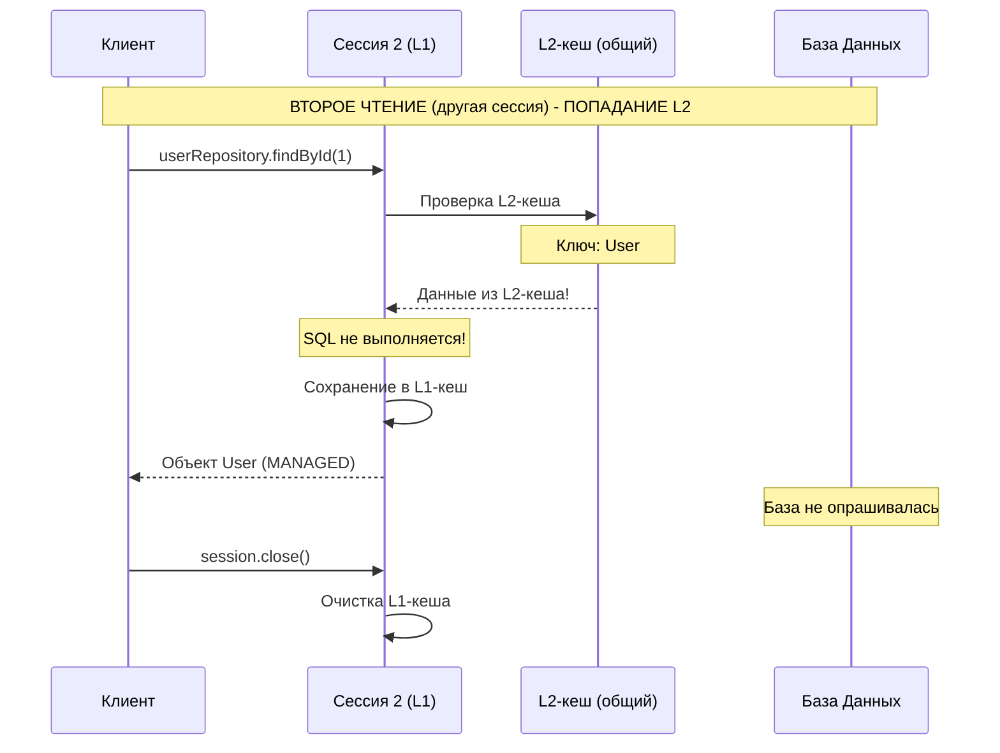
```mermaid
sequenceDiagram
    participant Client as Клиент
    participant S2 as Сессия 2 (L1)
    participant L2 as L2-кеш (общий)
    participant DB as База Данных

    Note over Client,DB: ВТОРОЕ ЧТЕНИЕ (другая сессия) - ПОПАДАНИЕ L2
    
    Client->>S2: userRepository.findById(1)
    S2->>L2: Проверка L2-кеша
    Note over L2: Ключ: User#1
    L2-->>S2: Данные из L2-кеша!
    
    Note over S2: SQL не выполняется!
    
    S2->>S2: Сохранение в L1-кеш
    S2-->>Client: Объект User (MANAGED)
    
    Note over DB: База не опрашивалась
    
    Client->>S2: session.close()
    S2->>S2: Очистка L1-кеша
```

##### 3. READ_ONLY-стратегия — попытка изменения

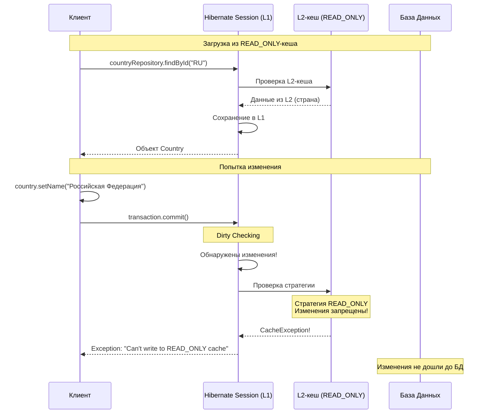
```mermaid
sequenceDiagram
    participant Client as Клиент
    participant Session as Hibernate Session (L1)
    participant L2 as L2-кеш (READ_ONLY)
    participant DB as База Данных

    Note over Client,DB: Загрузка из READ_ONLY-кеша
    
    Client->>Session: countryRepository.findById("RU")
    Session->>L2: Проверка L2-кеша
    L2-->>Session: Данные из L2 (страна)
    Session->>Session: Сохранение в L1
    Session-->>Client: Объект Country
    
    Note over Client,DB: Попытка изменения
    
    Client->>Client: country.setName("Российская Федерация")
    
    Client->>Session: transaction.commit()
    
    Note over Session: Dirty Checking
    Session->>Session: Обнаружены изменения!
    
    Session->>L2: Проверка стратегии
    Note over L2: Стратегия READ_ONLY<br/>Изменения запрещены!
    
    L2-->>Session: CacheException!
    Session-->>Client: Exception: "Can't write to READ_ONLY cache"
    
    Note over DB: Изменения не дошли до БД
```

##### 4. READ_WRITE-стратегия — обновление данных

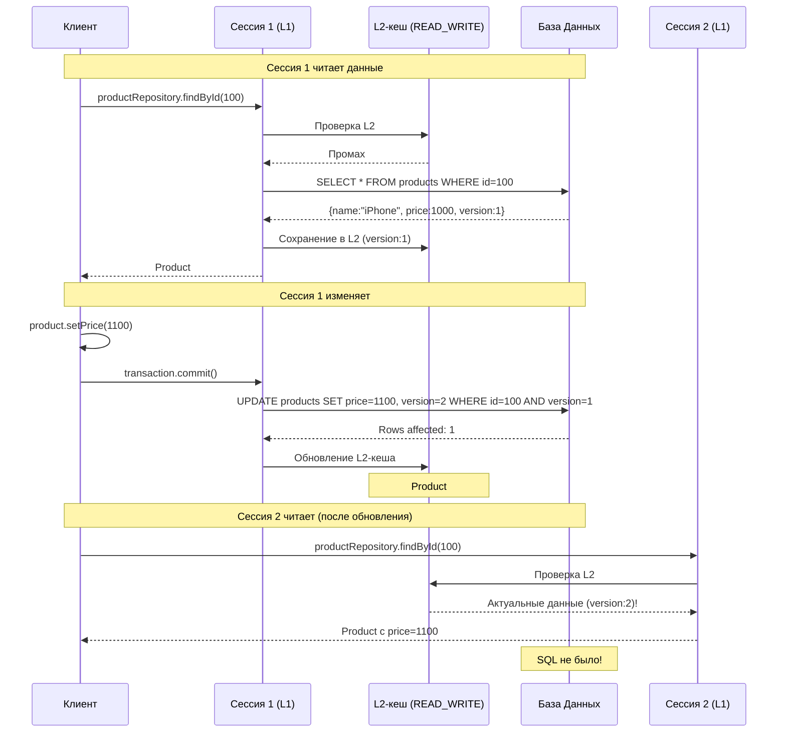
```mermaid
sequenceDiagram
    participant Client as Клиент
    participant S1 as Сессия 1 (L1)
    participant L2 as L2-кеш (READ_WRITE)
    participant DB as База Данных
    participant S2 as Сессия 2 (L1)

    Note over Client,DB: Сессия 1 читает данные
    
    Client->>S1: productRepository.findById(100)
    S1->>L2: Проверка L2
    L2-->>S1: Промах
    S1->>DB: SELECT * FROM products WHERE id=100
    DB-->>S1: {name:"iPhone", price:1000, version:1}
    S1->>L2: Сохранение в L2 (version:1)
    S1-->>Client: Product
    
    Note over Client,DB: Сессия 1 изменяет
    
    Client->>Client: product.setPrice(1100)
    Client->>S1: transaction.commit()
    S1->>DB: UPDATE products SET price=1100, version=2 WHERE id=100 AND version=1
    DB-->>S1: Rows affected: 1
    
    S1->>L2: Обновление L2-кеша
    Note over L2: Product#100 обновлен (version:2)
    
    Note over Client,DB: Сессия 2 читает (после обновления)
    
    Client->>S2: productRepository.findById(100)
    S2->>L2: Проверка L2
    L2-->>S2: Актуальные данные (version:2)!
    S2-->>Client: Product с price=1100
    Note over DB: SQL не было!
```

##### 5. Конфликт при READ_WRITE (оптимистичная блокировка)

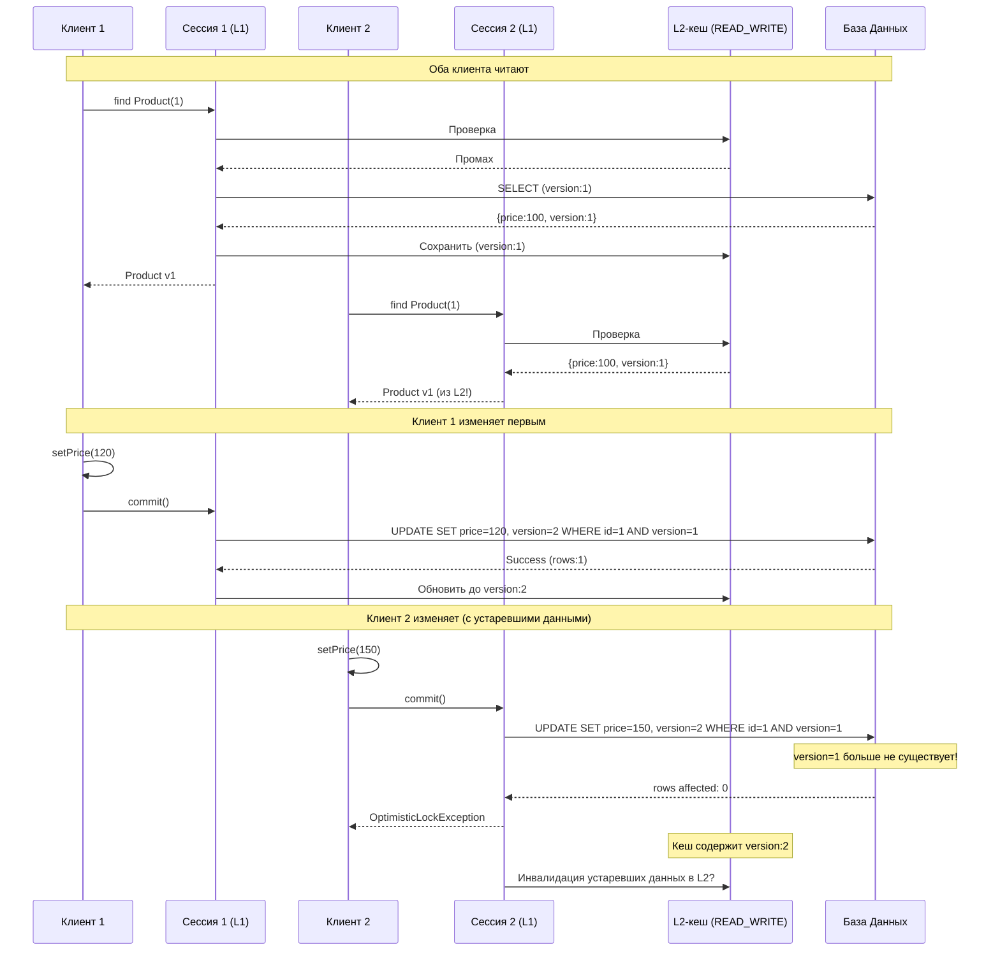
```mermaid
sequenceDiagram
    participant Client1 as Клиент 1
    participant S1 as Сессия 1 (L1)
    participant Client2 as Клиент 2
    participant S2 as Сессия 2 (L1)
    participant L2 as L2-кеш (READ_WRITE)
    participant DB as База Данных

    Note over Client1,DB: Оба клиента читают
    
    Client1->>S1: find Product(1)
    S1->>L2: Проверка
    L2-->>S1: Промах
    S1->>DB: SELECT (version:1)
    DB-->>S1: {price:100, version:1}
    S1->>L2: Сохранить (version:1)
    S1-->>Client1: Product v1
    
    Client2->>S2: find Product(1)
    S2->>L2: Проверка
    L2-->>S2: {price:100, version:1}
    S2-->>Client2: Product v1 (из L2!)
    
    Note over Client1,DB: Клиент 1 изменяет первым
    
    Client1->>Client1: setPrice(120)
    Client1->>S1: commit()
    S1->>DB: UPDATE SET price=120, version=2 WHERE id=1 AND version=1
    DB-->>S1: Success (rows:1)
    S1->>L2: Обновить до version:2
    
    Note over Client1,DB: Клиент 2 изменяет (с устаревшими данными)
    
    Client2->>Client2: setPrice(150)
    Client2->>S2: commit()
    S2->>DB: UPDATE SET price=150, version=2 WHERE id=1 AND version=1
    
    Note over DB: version=1 больше не существует!
    DB-->>S2: rows affected: 0
    
    S2-->>Client2: OptimisticLockException
    
    Note over L2: Кеш содержит version:2
    S2->>L2: Инвалидация устаревших данных в L2?
```

##### 6. NONSTRICT_READ_WRITE — асинхронное обновление

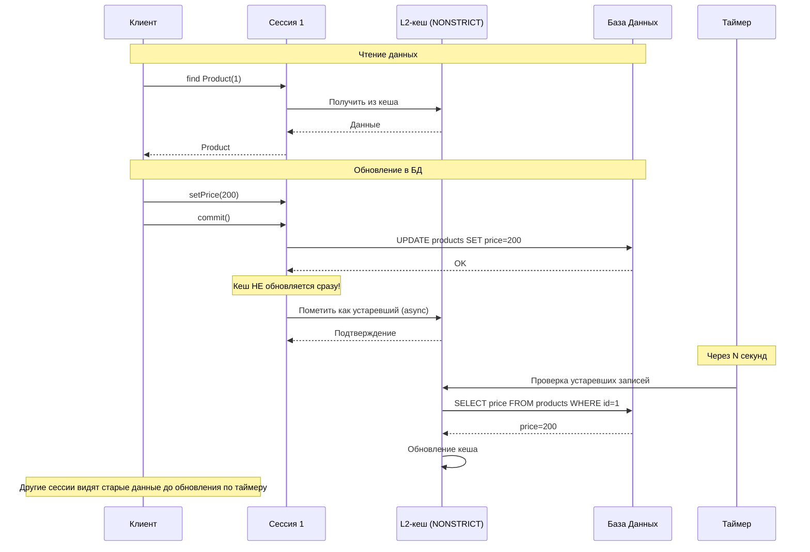
```mermaid
sequenceDiagram
    participant Client as Клиент
    participant S1 as Сессия 1
    participant L2 as L2-кеш (NONSTRICT)
    participant DB as База Данных
    participant Timer as Таймер

    Note over Client,DB: Чтение данных
    
    Client->>S1: find Product(1)
    S1->>L2: Получить из кеша
    L2-->>S1: Данные
    S1-->>Client: Product
    
    Note over Client,DB: Обновление в БД
    
    Client->>S1: setPrice(200)
    Client->>S1: commit()
    S1->>DB: UPDATE products SET price=200
    DB-->>S1: OK
    
    Note over S1: Кеш НЕ обновляется сразу!
    
    S1->>L2: Пометить как устаревший (async)
    L2-->>S1: Подтверждение
    
    Note over Timer: Через N секунд
    Timer->>L2: Проверка устаревших записей
    L2->>DB: SELECT price FROM products WHERE id=1
    DB-->>L2: price=200
    L2->>L2: Обновление кеша
    
    Note over Client: Другие сессии видят старые данные до обновления по таймеру
```

##### 7. Инвалидация L2-кеша при прямых изменениях в БД

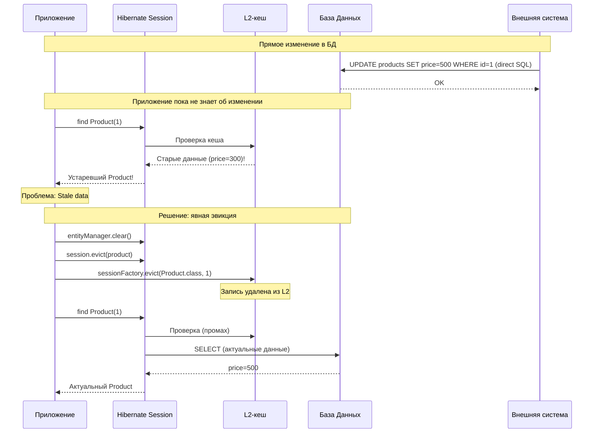
```mermaid
sequenceDiagram
    participant App as Приложение
    participant Session as Hibernate Session
    participant L2 as L2-кеш
    participant DB as База Данных
    participant External as Внешняя система

    Note over App,External: Прямое изменение в БД
    
    External->>DB: UPDATE products SET price=500 WHERE id=1 (direct SQL)
    DB-->>External: OK
    
    Note over App,DB: Приложение пока не знает об изменении
    
    App->>Session: find Product(1)
    Session->>L2: Проверка кеша
    L2-->>Session: Старые данные (price=300)!
    Session-->>App: Устаревший Product!
    
    Note over App: Проблема: Stale data
    
    Note over App,DB: Решение: явная эвикция
    
    App->>Session: entityManager.clear()
    App->>Session: session.evict(product)
    App->>L2: sessionFactory.evict(Product.class, 1)
    
    Note over L2: Запись удалена из L2
    
    App->>Session: find Product(1)
    Session->>L2: Проверка (промах)
    Session->>DB: SELECT (актуальные данные)
    DB-->>Session: price=500
    Session-->>App: Актуальный Product
```

##### 8. Кеширование коллекций (отношений)

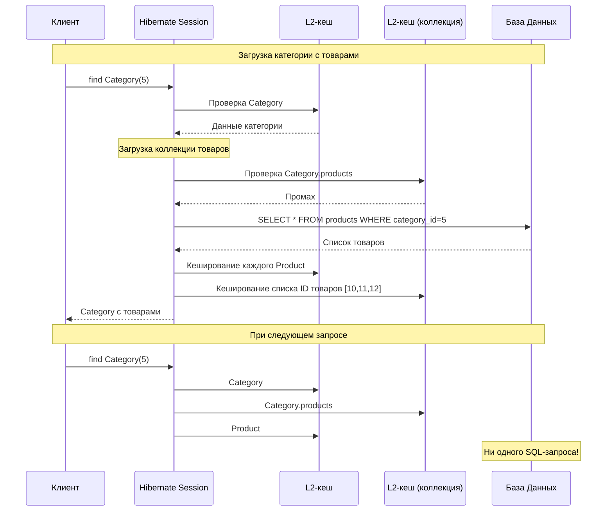
```mermaid
sequenceDiagram
    participant Client as Клиент
    participant Session as Hibernate Session
    participant L2 as L2-кеш
    participant L2Coll as L2-кеш (коллекция)
    participant DB as База Данных

    Note over Client,DB: Загрузка категории с товарами
    
    Client->>Session: find Category(5)
    Session->>L2: Проверка Category#5
    L2-->>Session: Данные категории
    
    Note over Session: Загрузка коллекции товаров
    
    Session->>L2Coll: Проверка Category.products#5
    L2Coll-->>Session: Промах
    
    Session->>DB: SELECT * FROM products WHERE category_id=5
    DB-->>Session: Список товаров
    
    Session->>L2: Кеширование каждого Product
    Session->>L2Coll: Кеширование списка ID товаров [10,11,12]
    
    Session-->>Client: Category с товарами
    
    Note over Client,DB: При следующем запросе
    
    Client->>Session: find Category(5)
    Session->>L2: Category#5 (из кеша)
    Session->>L2Coll: Category.products#5 (из кеша) 
    Session->>L2: Product#10,11,12 (из кеша)
    
    Note over DB: Ни одного SQL-запроса!
```

##### 9. Режимы работы с кешем (CacheMode)

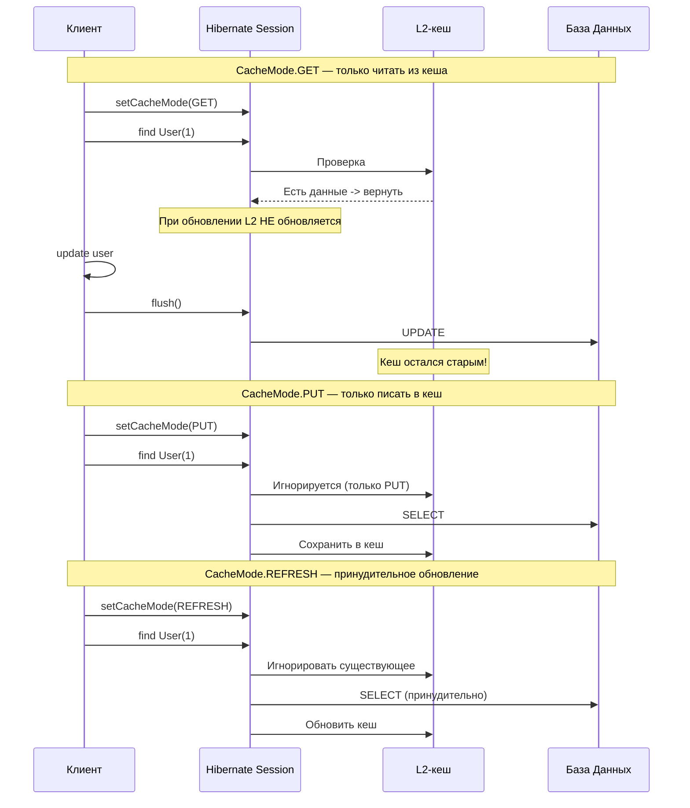
```mermaid
sequenceDiagram
    participant Client as Клиент
    participant Session as Hibernate Session
    participant L2 as L2-кеш
    participant DB as База Данных

    Note over Client,DB: CacheMode.GET — только читать из кеша
    
    Client->>Session: setCacheMode(GET)
    Client->>Session: find User(1)
    Session->>L2: Проверка
    L2-->>Session: Есть данные -> вернуть
    Note over Session: При обновлении L2 НЕ обновляется
    
    Client->>Client: update user
    Client->>Session: flush()
    Session->>DB: UPDATE
    Note over L2: Кеш остался старым!
    
    Note over Client,DB: CacheMode.PUT — только писать в кеш
    
    Client->>Session: setCacheMode(PUT)
    Client->>Session: find User(1)
    Session->>L2: Игнорируется (только PUT)
    Session->>DB: SELECT
    Session->>L2: Сохранить в кеш
    
    Note over Client,DB: CacheMode.REFRESH — принудительное обновление
    
    Client->>Session: setCacheMode(REFRESH)
    Client->>Session: find User(1)
    Session->>L2: Игнорировать существующее
    Session->>DB: SELECT (принудительно)
    Session->>L2: Обновить кеш
```

##### 10. Сравнение с L1 — полный стек кеширования

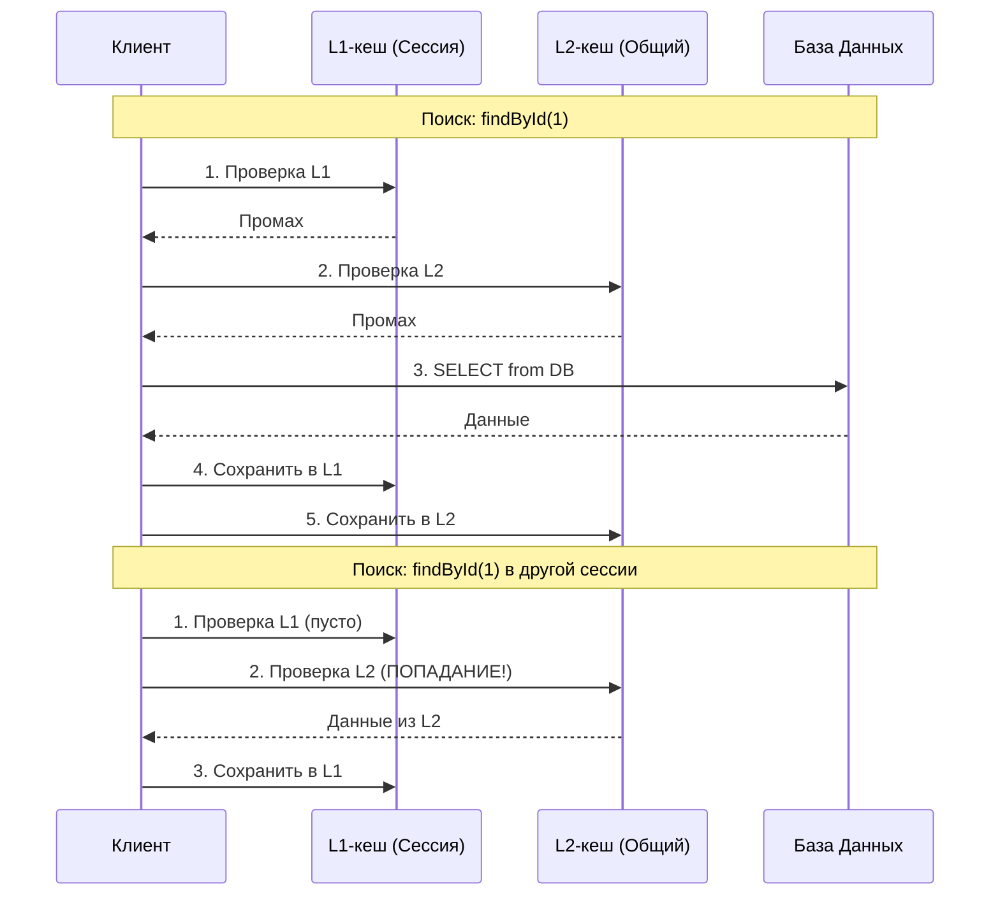
```mermaid
sequenceDiagram
    participant Client as Клиент
    participant L1 as L1-кеш (Сессия)
    participant L2 as L2-кеш (Общий)
    participant DB as База Данных

    Note over Client,DB: Поиск: findById(1)
    
    Client->>L1: 1. Проверка L1
    L1-->>Client: Промах
    
    Client->>L2: 2. Проверка L2
    L2-->>Client: Промах
    
    Client->>DB: 3. SELECT from DB
    DB-->>Client: Данные
    
    Client->>L1: 4. Сохранить в L1
    Client->>L2: 5. Сохранить в L2
    
    Note over Client,DB: Поиск: findById(1) в другой сессии
    
    Client->>L1: 1. Проверка L1 (пусто)
    Client->>L2: 2. Проверка L2 (ПОПАДАНИЕ!)
    L2-->>Client: Данные из L2
    Client->>L1: 3. Сохранить в L1
```


##### Кеш запросов (Query Cache) — важное дополнение

**Определение**: Query Cache хранит не сами сущности, а **список ID**, которые вернул запрос, вместе
с параметрами запроса.

**Как работает**

1. Выполняется запрос: `SELECT c FROM Country c WHERE c.active = true`.
2. Query Cache сохраняет: `{запрос + параметры} → [ID1, ID2, ID3]`.
3. При повторном запросе с теми же параметрами:
    - Query Cache возвращает список ID;
    - Hibernate загружает сущности по ID из L2-кеша (или из БД, если нет в L2).

**Критическая особенность**: Query Cache инвалидируется при **любом изменении** таблицы,
участвующей в запросе. Даже если изменилась запись, не удовлетворяющая условию `WHERE`, кеш
сбрасывается — Hibernate не может гарантировать, что изменение не повлияло на результат.

**Когда использовать Query Cache**
- Статичные справочники с редкими изменениями.
- Отчёты, которые пересчитываются раз в час/день.
- Динамические данные, часто обновляемые таблицы.

**Настройка**

```yaml
spring:
  jpa:
    properties:
      hibernate:
        cache:
          use_query_cache: true  # Включить кеш запросов
```

```java
// В репозитории — явно указать, что запрос можно кешировать
@Query("SELECT c FROM Country c WHERE c.active = :active")
@Cacheable
List<Country> findActiveCountries(@Param("active") boolean active);

// Или через QueryHints
@QueryHints(@QueryHint(name = "org.hibernate.cacheable", value = "true"))
List<Country> findByActive(boolean active);
```

---

### 2.2. Проблема N+1

#### Что это такое и почему это проблема?

**Проблема N+1** — классический антипаттерн производительности в ORM. Возникает, когда фреймворк
выполняет:

- **1 запрос** для получения списка сущностей;
- **N дополнительных запросов** для загрузки связанных данных для каждой сущности.

**Пример**: загрузили 100 постов. Для каждого нужно показать автора. Если связь `@ManyToOne`
настроена как `LAZY` (ленивая загрузка), то при обращении к `post.getAuthor()` для каждого поста
выполняется отдельный SQL-запрос.

```
Итого: 1 + 100 = 101 запрос к БД вместо 1!
```

#### Пример кода, вызывающего проблему

```java

@Entity
@Table(name = "posts")
public class Post {
    @Id
    private Long id;
    private String title;

    // По умолчанию fetch = LAZY — связанные комментарии не грузятся сразу
    @OneToMany(mappedBy = "post", fetch = FetchType.LAZY)
    private List<Comment> comments = new ArrayList<>();
}

@Entity
@Table(name = "comments")
public class Comment {
    @Id
    private Long id;
    private String content;

    @ManyToOne(fetch = FetchType.LAZY) // Автор поста грузится лениво
    @JoinColumn(name = "post_id")
    private Post post;
}

// Сервис, вызывающий проблему N+1
@Transactional(readOnly = true)
public void printPostsWithAuthors() {
    // Запрос №1: SELECT * FROM posts (загрузили 100 постов)
    List<Post> posts = postRepository.findAll();

    for (Post post : posts) {
        // Для каждого поста: Запрос №N: SELECT * FROM users WHERE id = ?
        // Выполняется при обращении к геттеру post.getAuthor()
        String authorName = post.getAuthor().getName();
        System.out.println("Post: " + post.getTitle() + ", Author: " + authorName);
    }
}
```

**SQL-логика в логах**

```sql
-- Запрос 1: получили список постов
select id, title, author_id from posts;

-- Запрос 2: автор для поста 1
select id, name from users where id = 101;

-- Запрос 3: автор для поста 2
select id, name from users where id = 102;

-- …и так далее 100 раз
```

#### Способы решения проблемы N+1

##### 1. JOIN FETCH в JPQL

**Определение**: `JOIN FETCH` — конструкция JPQL, которая указывает Hibernate загрузить ассоциацию **в том же SQL-запросе** через `LEFT JOIN` или `INNER JOIN`.

**Пример**

```java

@Repository
public interface PostRepository extends JpaRepository<Post, Long> {

    // DISTINCT обязателен: SQL JOIN возвращает дубликаты поста 
    // (по одной строке на каждый комментарий), Hibernate фильтрует их в памяти
    @Query("SELECT DISTINCT p FROM Post p JOIN FETCH p.author")
    List<Post> findAllWithAuthors();
}
```

**Результирующий SQL**

```sql
SELECT p.id, p.title, p.author_id, a.id, a.name 
FROM posts p 
LEFT JOIN users a ON p.author_id = a.id;
```

**Преимущества**

- Всего **1 запрос** к БД независимо от количества постов.
- Сущности остаются **управляемыми** (можно менять и сохранять).
- Простота реализации — одна аннотация.

**Недостатки**

- При наличии **нескольких коллекций** (`comments`, `tags`) возникает декартово произведение (дублирование строк).
- Сложно использовать с **пагинацией** (`Pageable`) — Hibernate может некорректно считать `COUNT`
  для JOIN-запросов.
- Загружает **все связанные данные**, даже если они не понадобятся в этом сценарии.

**Когда использовать**: когда точно знаете, что связанные данные нужны для **всех** сущностей
внутри транзакции, и вы планируете их изменять.

##### 2. @BatchSize (пакетная загрузка Hibernate)

**Определение**: аннотация `@BatchSize` говорит Hibernate: «Не делай N отдельных запросов, а
группируй ID и загружай данные пачками по `size` штук через `WHERE id IN (...)`».

**Пример**

```java

@Entity
@Table(name = "posts")
public class Post {
    @Id
    private Long id;
    private String title;

    @OneToMany(mappedBy = "post", fetch = FetchType.LAZY)
    @BatchSize(size = 10) // <-- Оптимизация: грузить комментариями по 10 штук
    private List<Comment> comments = new ArrayList<>();
}
```

**Логика SQL**

```sql
-- 1. Загружаем посты
SELECT id, title, author_id FROM posts;

-- 2. При первом обращении к comments для любого поста:
-- Пачка 1 (ID 1-10):
SELECT * FROM comments WHERE post_id IN (1,2,3,4,5,6,7,8,9,10);

-- Пачка 2 (ID 11-20):
SELECT * FROM comments WHERE post_id IN (11,12,13,14,15,16,17,18,19,20);

-- ... и так далее
```

**Преимущества**

- Сохраняет преимущества **ленивой загрузки** (данные грузятся, только если реально нужны).
- Не требует изменения JPQL-запросов в репозиториях.
- Легко добавляется: одна аннотация на поле.
- Работает **прозрачно** для бизнес-логики.

**Недостатки**

- Всё ещё **несколько запросов** (хоть и меньше, чем N).
- Зависит от **Hibernate** (не JPA-стандарт).
- Нужно подбирать оптимальный `size` эмпирически (слишком маленький — много запросов, слишком
  большой — перегрузка БД).

**Когда использовать**: для быстрого «лечения» существующего кода, когда связанные данные нужны не
всегда и нет возможности переписать все запросы на JOIN FETCH.

##### 3. @EntityGraph (стандарт JPA)

**Определение**: `EntityGraph` — стандартный механизм JPA 2.1 для декларативного описания «графа
загрузки» сущностей. Позволяет вынести логику предзагрузки из строк запросов в метаданные.

**Шаг 1: описать граф в сущности**

```java

@Entity
@Table(name = "posts")
@NamedEntityGraph(
    name = "Post.withAuthorAndComments", // Имя графа для ссылки в репозитории
    attributeNodes = {
        @NamedAttributeNode("author"),      // Загрузить автора
        @NamedAttributeNode("comments")     // Загрузить комментарии
    }
)
public class Post {
    @Id
    private Long id;
    private String title;

    @ManyToOne(fetch = FetchType.LAZY)
    private User author;

    @OneToMany(mappedBy = "post", fetch = FetchType.LAZY)
    private List<Comment> comments;
}
```

**Шаг 2: использовать в репозитории**

```java

@Repository
public interface PostRepository extends JpaRepository<Post, Long> {

    // Указываем имя графа и тип загрузки
    @EntityGraph(value = "Post.withAuthorAndComments", type = EntityGraphType.LOAD)
    List<Post> findAll();
}
```

**Типы EntityGraph**

- `EntityGraphType.LOAD`: атрибуты, **НЕ** указанные в графе, загружаются согласно `FetchType` из
  маппинга (EAGER или LAZY).
- `EntityGraphType.FETCH`: все атрибуты, **НЕ** указанные в графе, загружаются лениво (LAZY),
  независимо от маппинга.

**Преимущества**

- **Стандарт JPA** (не привязан к Hibernate) — портативность между провайдерами.
- **Отделение логики загрузки** от бизнес-запросов — один граф можно переиспользовать в разных
  методах.
- Можно создавать графы **динамически в runtime** через `EntityManager.createEntityGraph()`.

**Недостатки**

- Меньше гибкости, чем в JPQL (сложнее добавить условия `WHERE`, `ORDER BY`).
- Требует больше кода для настройки (аннотации на сущности + использование в репозитории).
- Не все провайдеры JPA поддерживают одинаково хорошо.

**Когда использовать**: когда логика загрузки конфигурируется внешними параметрами или для
сложных сценариев с условной загрузкой разных графов.

---

### 2.3. Пагинация и сортировка

#### Зачем нужна пагинация?

Загрузка всех данных сразу через `findAll()` — опасная практика по трём причинам.

| Причина | Последствие | Пример |
|---------|-------------|--------|
| **Память (Memory)** | `OutOfMemoryError` в JVM | Загрузка 1 000 000 сущностей Post по 500 байт = 500 МБ + накладные расходы Hibernate |
| **Сеть (Network)** | Медленные ответы API, перегрузка трафика | JSON-ответ на 10 000 записей = 10–50 МБ, загрузка 5–30 секунд |
| **UX (User Experience)** | Неудобство для пользователя | Бесконечный список без навигации, невозможно найти нужное |

#### Spring Data Pageable: интерфейс для пагинации

**Pageable** — интерфейс для передачи параметров пагинации в репозиторий. Чаще всего используется
его реализация `PageRequest`.

**Пример создания**

```java
// Страница 0, размер 10, сортировка по убыванию title, затем по id
final Pageable pageable = PageRequest.of(
        0,                          // pageNumber: номер страницы (нумерация с 0!)
        10,                         // pageSize: сколько записей вернуть (LIMIT)
        Sort.by(                    // Параметры сортировки
            Sort.Order.desc("title"), // Сначала по title DESC
            Sort.Order.asc("id")      // Затем по id ASC для стабильности
        )
    );
```

**Разбор параметров**

| Параметр | Тип | Описание | Нюансы |
|----------|-----|----------|--------|
| `pageNumber` | `int` | Номер страницы | **Нумерация с 0!** Первая страница = 0, вторая = 1. Ошибка: передача 1 для «первой страницы» пропустит первые 10 записей |
| `pageSize` | `int` | Размер страницы (LIMIT) | Оптимальное значение: 20–100. Слишком большое — перегрузка памяти, слишком маленькое — много запросов при скролле |
| `sort` | `Sort` | Параметры сортировки | **Всегда указывайте сортировку при пагинации!** Без `ORDER BY` БД не гарантирует порядок строк, что приведёт к дубликатам/пропускам при переключении страниц |

#### Типы возвращаемых данных из репозитория

##### 1. Page<T> — полная информация

```java

@Repository
public interface PostRepository extends JpaRepository<Post, Long> {
    Page<Post> findAll(Pageable pageable);
}
```

**Что содержит Page**

```java
Page<Post> page = postRepository.findAll(pageable);

page.getContent();        // List<Post> — данные текущей страницы
page.getTotalElements();  // long — общее количество записей в БД
page.getTotalPages();     // int — общее количество страниц
page.getNumber();         // int — текущий номер страницы
page.getSize();           // int — размер страницы
page.hasPrevious();       // boolean — есть ли предыдущая страница
page.hasNext();           // boolean — есть ли следующая страница
```

**Проблема производительности**: для заполнения `totalElements` Spring Data JPA выполняет *
*второй SQL-запрос**.

```sql
SELECT count(*) FROM posts WHERE ... -- условия из исходного запроса
```

На сложных запросах с `JOIN`, `GROUP BY` этот `COUNT` может быть **дороже**, чем сам запрос данных!

##### 2. Slice<T> — легковесная альтернатива

```java

@Repository
public interface PostRepository extends JpaRepository<Post, Long> {
    Slice<Post> findAll(Pageable pageable);
}
```

**Что содержит Slice**

```java
Slice<Post> slice = postRepository.findAll(pageable);

slice.getContent();   // List<Post> — данные текущей страницы
slice.hasNext();      // boolean — есть ли следующая страница
// НЕТ: getTotalElements(), getTotalPages()
```

**Как работает `hasNext()` без COUNT**

1. Spring запрашивает `pageSize + 1` записей (например, 21 вместо 20).
2. Если вернулась 21 запись → `hasNext = true` (есть ещё данные).
3. Если вернулось ≤ 20 записей → `hasNext = false` (это последняя страница).
4. Лишняя запись отбрасывается перед возвратом клиенту.

**Преимущества Slice**

- **Нет COUNT-запроса** — значительная экономия на сложных запросах.
- Идеально для **«бесконечного скролла»** (Infinite Scroll) в мобильных приложениях, где
  пользователю не нужно знать общее количество.

**Недостатки**

- Нельзя показать «Страница 3 из 15» — нет общего количества.
- Не подходит для классической пагинации с номерами страниц.

**Когда использовать Slice**: мобильные приложения, бесконечный скролл, отчёты с большим объёмом
данных, где важна скорость, а не точное количество.

#### Почему сортировка обязательна при пагинации?

**Технически** сортировка не обязательна — запрос выполнится и без `ORDER BY`. **Но на практике это
критично.**

**Проблема**: реляционные СУБД не гарантируют порядок строк при запросах без `ORDER BY`. Порядок
может зависеть от:

- плана выполнения запроса (который меняется со временем),
- параллельных транзакций,
- фрагментации индексов,
- версии СУБД.

**Последствие**: при переходе со страницы 1 на страницу 2 ты можешь:

- получить **дубликаты** (записи со страницы 1 повторятся на странице 2);
- **пропустить записи** (некоторые записи не попадут ни в одну страницу).

**Решение**: всегда указывай сортировку, причём **уникальную** (чтобы порядок был
детерминированным).

```java
// Плохо: сортировка только по title (могут быть дубликаты title)
Sort.by("title")

// Хорошо: сортировка по title + уникальный id для стабильности
Sort.by(Sort.Order.desc("title"),Sort.Order.asc("id"))
```

---

## 3. Дополнительные возможности и инструментарий

### 3.1. Мониторинг и отладка

#### Встроенная статистика Hibernate

**Зачем**: понимать, что происходит «под капотом» — сколько запросов выполняется, как часто
срабатывает кеш, есть ли проблемы с N+1.

**Включение в application.yml**

```yaml
spring:
  jpa:
    properties:
      hibernate:
        show_sql: true              # Выводить SQL в консоль (для отладки)
        format_sql: true            # Форматировать SQL для читаемости
        generate_statistics: true   # Собирать статистику выполнения
```

**Просмотр статистики через код**

```java

@Autowired
private EntityManagerFactory emf;

public void logStats() {
    // Получаем Statistics из Hibernate SessionFactory
    Statistics stats = emf.unwrap(SessionFactory.class).getStatistics();

    System.out.println("=== Hibernate Statistics ===");
    System.out.println("Запросов выполнено: " + stats.getQueryExecutionCount());
    System.out.println("Сущностей загружено: " + stats.getEntityLoadCount());
    System.out.println("Коллекций загружено: " + stats.getCollectionLoadCount());
    System.out.println("L2-кеш: попаданий=" + stats.getSecondLevelCacheHitCount()
        + ", промахов=" + stats.getSecondLevelCacheMissCount());
    System.out.println("Время выполнения запросов: " + stats.getQueryExecutionMaxTime() + " мс");
}
```

**Полезные метрики**

- `getQueryExecutionCount()` — общее количество выполненных JPQL-/SQL-запросов.
- `getEntityLoadCount()` — сколько сущностей загружено из БД.
- `getCollectionLoadCount()` — сколько коллекций (@OneToMany) инициализировано.
- `getSecondLevelCacheHitCount()`/`MissCount()` — эффективность L2-кеша.
- `getQueryExecutionMaxTime()` — самый долгий запрос (помогает найти узкие места).

#### P6Spy / Datasource Proxy — перехват JDBC

**Проблема стандартных логов Hibernate**: параметры запросов показываются как `?`, что затрудняет
отладку.

```
Hibernate: select * from posts where title = ? /* parameters: [?] */
```

**Решение**: P6Spy — библиотека-перехватчик, которая встраивается между приложением и
JDBC-драйвером, показывая **реальный SQL с подставленными параметрами**.

**Подключение**

1. **Зависимость (build.gradle)**
   ```gradle
   implementation 'p6spy:p6spy'
   ```

2. **Конфигурация datasource (application.yml)**
   ```yaml
   spring:
     datasource:
       url: jdbc:p6spy:postgresql://localhost:5432/mydb  # Добавляем p6spy:
       driver-class-name: com.p6spy.engine.spy.P6SpyDriver  # Меняем драйвер
       username: myuser
       password: mypass
   ```

3. **Настройка формата вывода (spy.properties в resources)**
   ```properties
   # Формат лога: время|соединение|SQL
   logMessageFormat=com.p6spy.engine.spy.appender.CustomLineFormat
   customLogMessageFormat=%(currentTime) | took %(duration)ms | connection %(connectionId) | %(category) | %(sql)
   
   # Исключить служебные запросы
   excludecategories=info,debug,result,resultset
   
   # Логировать в консоль
   appender=com.p6spy.engine.spy.appender.StdoutLogger
   ```

**Пример вывода в консоль**

```
1633024800123 | took 15ms | connection 3 | statement | 
INSERT INTO posts(title, user_id, created_at) VALUES('Spring JPA Guide', 42, '2024-01-15 10:30:00')
```

**Преимущества P6Spy**

- Видны реальные параметры запросов (не `?`).
- Время выполнения каждого запроса.
- Идентификатор соединения для отладки пула.
- Работает с любой СУБД (PostgreSQL, MySQL, Oracle).

**Важно**: не используй P6Spy в production! Он добавляет накладные расходы. Только для
development/staging.

#### Hypersistence-utils — библиотека Vlad Mihalcea

**Автор**: Vlad Mihalcea — главный коммитер Hibernate, автор книги «High-Performance Java
Persistence».

**[GitHub](https://github.com/vladmihalcea/hypersistence-utils).**

**Зачем нужна**: расширяет возможности Hibernate / Spring Data JPA, особенно для работы с
нестандартными типами данных и оптимизации репозиториев.

##### Кастомные типы данных

| Тип | Назначение | Пример использования |
|-----|-----------|---------------------|
| `JsonType`/`JsonBinaryType` | Маппинг JSON-колонок (PostgreSQL `jsonb`, MySQL `json`) в Java-объекты | `@Type(JsonBinaryType.class) private Map<String, Object> metadata;` |
| `ArrayType` | Работа с PostgreSQL `ARRAY` как с Java `List` или массивами | `@Type(ArrayType.class) private List<String> tags;` |
| `EnumType` | Безопасный маппинг enum с сохранением имени/ординала в БД | `@Type(EnumType.class) private Status status;` |
| `InetType` | Поддержка PostgreSQL `inet` (IP-адреса) | `@Type(InetType.class) private InetAddress clientIp;` |
| `RangeType` | Работа с PostgreSQL-диапазонами (`int4range`, `tsrange`) | `@Type(RangeType.class) private Range<LocalDate> bookingPeriod;` |

**Пример с JSON**

```java

@Entity
public class Product {
    @Id
    private Long id;
    private String name;

    // Маппинг PostgreSQL jsonb в Java Map
    @Column(columnDefinition = "jsonb")
    @Type(JsonBinaryType.class)
    private Map<String, Object> specifications;

    // Или в POJO через Jackson
    @Column(columnDefinition = "jsonb")
    @Type(JsonBinaryType.class)
    private ProductAttributes attributes; // Класс с @JsonIgnoreProperties(ignoreUnknown = true)
}
```

##### Безопасные репозитории

**Проблема стандартного `JpaRepository`**: методы вроде `findAll()` без пагинации или
`saveAll(Iterable)` могут привести к:

- `OutOfMemoryError` при загрузке миллионов записей;
- проблемам N+1 при неосторожном использовании.

**Решение от Hypersistence-utils**

```java
// Вместо JpaRepository используем BaseJpaRepository
public interface ProductRepository extends BaseJpaRepository<Product, Long> {
    // findAll() без параметров НЕ доступен — защита от OOM
    // findAll(Pageable pageable) — обязателен параметр пагинации
}
```

**Преимущества `BaseJpaRepository`**

- Убирает опасные методы (`findAll()`, `saveAll(Iterable)`).
- Требует явного указания пагинации для массовых операций.
- Документирует лучшие практики на уровне типа.

**Подключение**

```java

@Configuration
@EnableJpaRepositories(
    repositoryBaseClass = BaseJpaRepositoryImpl.class // Указываем базовый класс
)
public class JpaConfig {
}
```

---

### 3.2. QueryHints в Spring Data JPA

**Определение**: `QueryHints` — механизм передачи vendor-specific подсказок JDBC/Hibernate для
тонкой настройки выполнения запросов.

**Синтаксис**

```java

@Repository
public interface PostRepository extends JpaRepository<Post, Long> {

    @QueryHints({
        // Оптимизация: отключение dirty-checking для read-only запросов
        @QueryHint(name = "org.hibernate.readOnly", value = "true"),

        // Streaming больших результатов: загружать по 100 записей за раз
        @QueryHint(name = "org.hibernate.fetchSize", value = "100"),

        // Таймаут запроса: отменить, если выполняется дольше 5 секунд
        @QueryHint(name = "org.hibernate.timeout", value = "5000"),

        // Подсказка для кеширования результата запроса
        @QueryHint(name = "org.hibernate.cacheable", value = "true"),
        @QueryHint(name = "org.hibernate.cacheRegion", value = "postQueryCache")
    })
    List<Post> findByTitle(String title);
}
```

**Разбор популярных hints**

| Hint | Значение | Когда использовать |
|------|----------|-------------------|
| `org.hibernate.readOnly` | `true/false` | Для запросов только на чтение — отключает dirty checking, экономит память и CPU |
| `org.hibernate.fetchSize` | Число записей | Для streaming больших результатов — загружать частями, а не всё сразу в память |
| `org.hibernate.timeout` | Тайм-аут в мс | Для защиты от «зависших» запросов на медленных БД или при блокировках |
| `org.hibernate.cacheable` | `true/false` | Разрешить кеширование результата запроса (требует включенного L2 и Query Cache) |
| `org.hibernate.cacheRegion` | Имя региона | Указать регион кеша для группировки и настройки TTL |
| `javax.persistence.lock.timeout` | Тайм-аут в мс | Для пессимистичных блокировок — сколько ждать освобождения строки |

**Нюанс `readOnly = true`**: может значительно ускорить запросы только на чтение, так как Hibernate:

- не создаёт снапшоты объектов для dirty checking;
- не отслеживает изменения полей;
- может использовать оптимизации на уровне СУБД (например, `SELECT ... FOR SHARE` вместо
  `FOR UPDATE`).

---

### 3.3. Блокировки (Locking)

Управление конкурентным доступом к данным — критично для приложений с высокой нагрузкой.

#### Оптимистичная блокировка (@Version)

**Определение**: механизм контроля параллелизма, при котором проверка конфликта версий происходит **только в момент фиксации транзакции (commit)**. Блокировок на уровне БД не выставляется.

**Реализация**

```java

@Entity
@Table(name = "posts")
public class Post {
    @Id
    private Long id;

    @Version // Поле версии — обязательно для оптимистичной блокировки
    private Long version; // Или Integer

    private String title;
    private String content;
}
```

**Механика работы**

```java

@Transactional
public void updatePost(Long id) {
    // 1. Загружаем пост (версия = 5)
    Post post = postRepository.findById(id).get();

    // 2. Изменяем данные
    post.setTitle("New Title");

    // 3. При commit():
    //    Hibernate генерирует: 
    //    UPDATE posts SET title='New Title', version=6 
    //    WHERE id=? AND version=5
    //    
    //    Если version в БД != 5 → OptimisticLockException
}
```

**Преимущества**

- Нет блокировок на уровне БД — высокая конкурентность.
- Подходит для веб-приложений с короткими транзакциями.
- Простота реализации — одна аннотация `@Version`.

**Недостатки**

- Транзакция откатывается при конфликте — нужна стратегия retry.
- Не подходит для долгих транзакций (высокий риск конфликта).

**Стратегия retry (пример)**

```java

@Service
public class PostService {

    @Retryable(
        value = OptimisticLockingFailureException.class,
        maxAttempts = 3,
        backoff = @Backoff(delay = 100, multiplier = 2)
    )
    @Transactional
    public void updateWithRetry(Long id, String newTitle) {
        Post post = postRepository.findById(id).orElseThrow();
        post.setTitle(newTitle);
        // При конфликте будет выброшено OptimisticLockingFailureException,
        // и метод будет перезапущен до 3 раз с экспоненциальной задержкой
    }
}
```

#### Пессимистичная блокировка

**Определение**: механизм, при котором строка в БД блокируется **непосредственно в момент чтения** (
`SELECT ... FOR UPDATE`), предотвращая доступ других транзакций до завершения текущей.

**Использование через @Lock**

```java

@Repository
public interface PostRepository extends JpaRepository<Post, Long> {

    @Lock(LockModeType.PESSIMISTIC_WRITE) // Блокировка на запись
    @Query("SELECT p FROM Post p WHERE p.id = :id")
    Optional<Post> findByIdWithLock(@Param("id") Long id);

    // Альтернатива: через метод Naming Convention
    @Lock(LockModeType.PESSIMISTIC_READ)
    // Блокировка на чтение (shared lock)
    Optional<Post> findById(Long id);
}
```

**Типы блокировок**
| Тип | SQL | Описание |
|-----|-----|----------|
| `PESSIMISTIC_READ` | `SELECT ... FOR SHARE` | Разрешает другим читать, но не писать |
| `PESSIMISTIC_WRITE` | `SELECT ... FOR UPDATE` | Блокирует на чтение и запись для других |
| `PESSIMISTIC_FORCE_INCREMENT` | `SELECT ... FOR UPDATE` + инкремент @Version | Как WRITE, но также
инкрементирует версию |

**Преимущества**

- Гарантия консистентности данных.
- Нет `OptimisticLockException` — конфликт предотвращается на уровне БД.
- Подходит для долгих транзакций и критичных операций (финансы, инвентарь).

**Недостатки**

- Риск **deadlock'ов** (взаимных блокировок) при неправильном порядке доступа к данным.
- Снижение параллелизма — другие транзакции ждут освобождения блокировки.
- Зависимость от СУБД — синтаксис и поведение могут отличаться.

**Правила безопасного использования**

- Держи транзакции с пессимистичными блокировками **как можно короче**.
- Всегда обращайся к таблицам в **одинаковом порядке** во всех транзакциях (предотвращение
   deadlock).
- Устанавливай **тайм-ауты** на блокировки:
   `@QueryHint(name = "javax.persistence.lock.timeout", value = "3000")`.

---

## Резюме

### Ключевые выводы по каждому разделу

#### Расширение репозиториев

- **Naming Convention** — быстро и типобезопасно для простых запросов.
- **@Query** — гибко и явно для сложных JPQL/SQL.
- **Custom Interface** — максимальная гибкость с доступом к `EntityManager`.

#### Кеширование

- **L1** всегда включён (уровень транзакции), обеспечивает Identity Map и dirty checking.
- **L2** опционален (уровень приложения), идеален для справочников с стратегией `READ_ONLY`.
- **Query Cache** — дополнение к L2, но инвалидируется при любом изменении таблицы.

#### Проблема N+1

- Главный враг производительности в JPA.
- **JOIN FETCH** — 1 запрос, но загружает всё сразу.
- **@BatchSize** — N/size запросов, сохраняет ленивую загрузку.
- **@EntityGraph** — стандарт JPA, декларативное описание графа загрузки.

#### Пагинация

- Всегда используй пагинацию для списков (защита от OOM).
- **Page**, когда нужно общее количество (с COUNT-запросом).
- **Slice** для бесконечного скролла (без COUNT, экономит запрос).
- **Всегда добавляй сортировку** с уникальным полем для стабильности.

#### Инструменты

- **P6Spy** — отладка SQL с параметрами (только dev/staging).
- **Hibernate Statistics** — мониторинг производительности.
- **Hypersistence-utils** — расширение типов и безопасные репозитории.

#### Блокировки

- **Оптимистичные** (`@Version`) — для веба, коротких транзакций, высокой конкурентности.
- **Пессимистичные** (`@Lock`) — для критичных данных, долгих транзакций, гарантий консистентности.

### Золотые правила Spring Data JPA

1. **Мониторь SQL** в development — то, что работает на 10 записях, может «упасть» на 10 000.
2. **Используй пагинацию** всегда для списков, даже если «сейчас данных мало».
3. **Тестируй с реалистичным объёмом данных** — производительность нелинейна.
4. **Разделяйте чтение и запись** — `@Transactional(readOnly = true)` для запросов ускоряет работу.
5. **Документируйте сложные запросы** — JPQL/SQL в `@Query` должен быть понятен через 6 месяцев.
